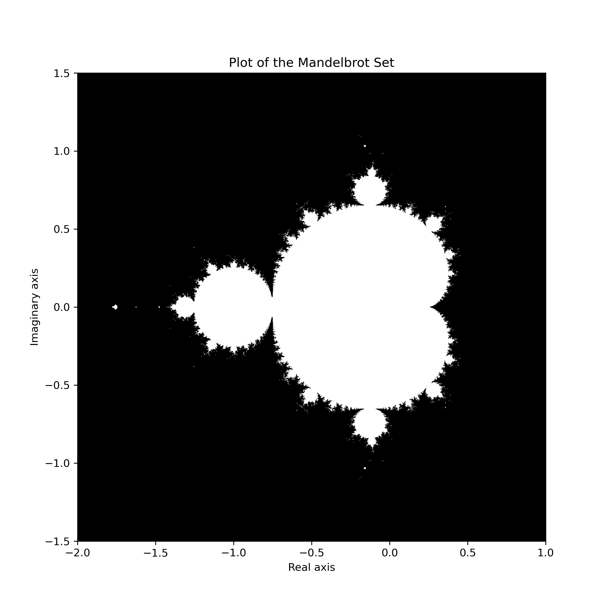
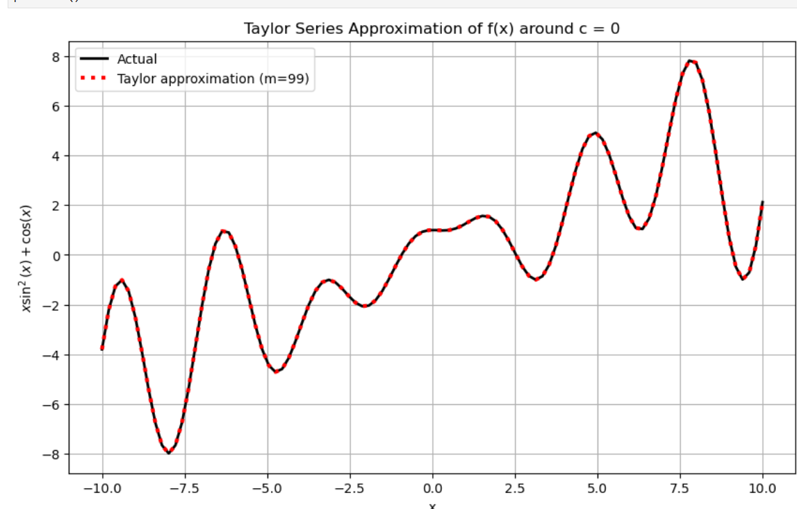
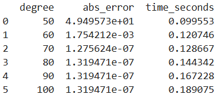

# AMS 595 Project 4: Mandelbrot Fractal, Markov Chains, and Taylor Approximation

## Introduction

There are 3 sections to this project. First, we compute the Mandelbrot set over the range [-2,1] x [-1.5,1.5] and construct an image of the Mandelbrot fractal. In the second part, we work with Markov chains and create a script that works with 5 states. In the third part, we write a script that can approximate any function using Taylor series approximation and measure the elapsed time as well as the absolute error for different polynomial degrees. 

## Computing the Mandelbrot Fractal

In this section, we write a Python script which computes the Mandelbrot set over the range [-2,1] x [-1.5,1.5], using a threshold of 50. Given the following iteration:

$$
z_{n+1} = z_n^2 + c, \quad z_i,\, c \in \mathbb{C}
$$

consider that $z_0 = 0$. This iteration will be bounded or diverge to infinity, based on the value that is chosen for $c$. A complex number $c$ is part of the Mandelbrot set $M$ if, using $c$ in the above iteration:

$$
|z_i| < \infty \quad \text{for all } i > 0
$$

To compute the Mandelbrot set with the specified parameters, we start by creating a grid of complex numbers using the `numpy` library. Next, we create a boolean `mask` variable indicating which points are in the set. To compute the values in the Mandelbrot set, we use the above iteration.  

We modify the iteration to update the value of $z_{ij}$ only if:

$$
|z_{ij}| < \text{threshold}
$$

After computing the values inside the Mandelbrot set, we can plot an image of the Mandelbrot fractal using `matplotlib`.

## Markov Chains

A Markov transition chain transition matrix $P$ has a set of $n$ states, where $p_{ij}$ is the probability, $0 \leq P_{ij} \leq 1$, of going from state $i$ to state $j$. Each row is normalized so that:

$$
\sum_{j=1}^{n} P_{ij} = 1
$$

In this section, we create a Python script that works with 5 states.

### Task 1: Constructing Random 5x5 Matrix with Normalized Rows

We use `numpy` to generate a random 5x5 matrix. Then, we normalize each row so that:

$$
\sum_{j=1}^{5} p_{ij} = 1
$$

### Task 2: Constructing a Random Normalized Size-5 Vector $p$

We construct a random size-5 vector $p$ and normalize it so that:

$$
\sum_{j=1}^{5} p_{j} = 1
$$

After creating this initial probability vector $p$, we apply the transition rule 50 times to obtain $p_{50}$.

### Task 3: Obtaining the Stationary Distribution

To obtain the stationary distribution, we compute the eigenvector $v$ of $P^T$ corresponding to the eigenvalue 1 and scale it so that:

$$
\sum_{j=1}^{5} v_j = 1
$$

### Task 4: Computing Component-Wise Difference Between $p_{50}$ and the Stationary Distribution

We check to see if $p_{50}$ matches the stationary distribution. In theory, they should be very similar if 50 iterations is enough.

$p_{50}$ and the stationary distribution match within tolerance $10^{-5}$.

## Taylor Series Approximation

For a function $f$ that is infinitely differentiable, its Taylor Series around a point $c$ is:

$$
\sum_{n=0}^{\infty} \frac{f^{(n)}(c)}{n!} (x - c)^n 
= f(c) + f'(c)(x - c) + \frac{f''(c)}{2}(x - c)^2 + \frac{f'''(c)}{3!}(x - c)^3 + \cdots
$$

We can approximate a function using the truncated series:

$$
f(x) \approx \sum_{n=0}^{m} \frac{f^{(n)}(c)}{n!} (x - c)^n
$$

### Task 1: Writing a Function That Can Approximate a Function Using Taylor Series

The function takes the following inputs:

- `func`: function to approximate  
- `start`: beginning of the interval  
- `end`: end of the interval  
- `degree`: last integer to truncate the series  
- `fixed_c`: the point $c$ around which we expand  

It outputs a NumPy array representing the approximation of $f$ over the interval. Each term of the series is computed using symbolic derivatives and summed iteratively.

### Task 2: Testing the Function with Specified Parameters

We test the function with:

- $f(x) = x \sin^2(x) + \cos(x)$  
- Numerical domain: [-10, 10] with 100 points  
- Total of 100 terms in the series  
- Expand around $c = 0$  

We use a solid line for the actual function and a red dotted line for the approximation.

### Task 3: Modifying the Function to Measure Error and Elapsed Time for Different Degrees

We add the following inputs:

- initial degree  
- final degree  
- degree step  

For example, using 50 as initial, 100 as final, and 10 as the step, the function computes absolute error and elapsed time for degrees 50, 60, 70, …, 100.

Higher polynomial degrees increase accuracy but also computation time. A degree of 100 is more accurate but takes roughly twice as long as a degree of 50.  

